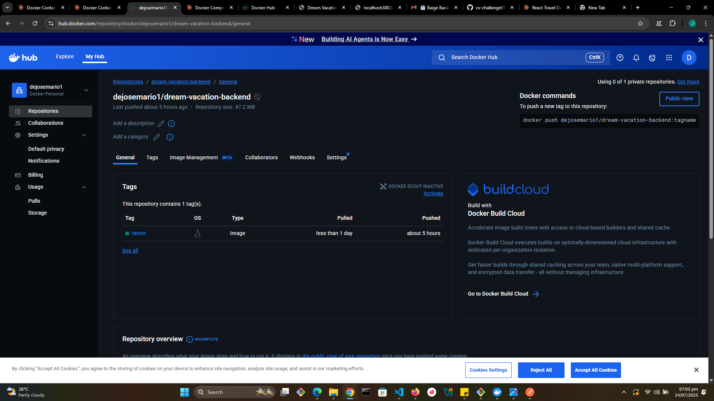
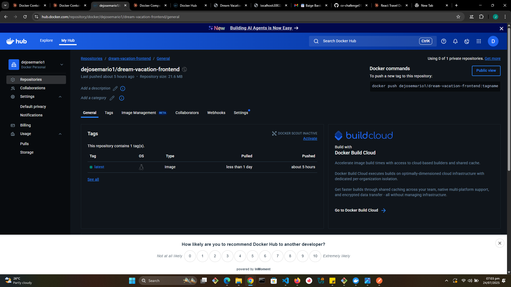
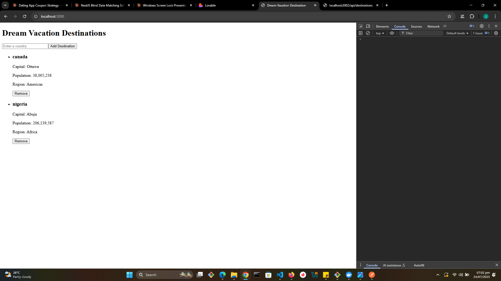

# Dream Vacation Destinations App

A simple app to manage a list of dream vacation countries with basic info, containerized with Docker. 

## Setup

1. Install Docker and Docker Compose.
2. Clone the repo: `git clone <repository-url> && cd dream-vacation-destinations`
3. Create `.env` file:
4. Run: `docker-compose up --build`
5. Open: `http://localhost:{port}`

## Project Overview
- **Front and Backend code**:  Sourced from  [Dream-Vacation-App:](https://github.com/obusorezekiel/Dream-Vacation-App).
- **View Country Details**: Displays capital, population, and region information for each country.
- **Remove Countries**: Users can remove countries from their list.
- **Production-Ready Setup**: The project is designed to be scalable and maintainable, following industry-standard practices for deployment and CI/CD.

## 🚀 Usage

### 1. Clone the repo

```bash
git clone https://github.com/your-username/Dream-Vacation-App.git
cd Dream-Vacation-App
```

### 2. Create a `.env` file at the root:

```env
DB_NAME=yourdatabasename
DB_USER=yourusername
DB_PASSWORD=yourpassword
DB_PORT=5432

BACKEND_PORT=3001
NODE_ENV=production

FRONTEND_PORT=3000

COUNTRIES_API_BASE_URL=https://restcountries.com/v3.1

DATABASE_URL=postgresql://postgres:<password>@db:5432/<dbname>
```

### 3. Start the application

```bash
docker-compose up --build
```

* Frontend: [http://localhost:3000](http://localhost:3000)
* Backend: [http://localhost:3001](http://localhost:3001)
* PostgreSQL: localhost:5432

---

## 📤 Pushed Docker Images

* **Frontend**: `docker.io/your-username/dream-vacation-frontend`
* **Backend**: `docker.io/your-username/dream-vacation-backend`

---

## ✅ Features

* Multi-stage Docker builds for optimized frontend
* Distinct services for clear separation of responsibilities
* Environment setup using .env file at the root
* Suitable for local and production Docker deployments
* Persistent PostgreSQL data with Docker volumes


## 📤 My Docker Hub Pushed Images In My Repositories

### Backend Repository

*Caption: Dream Vacation Backend repository on Docker Hub*

### Frontend Repository

*Caption: Dream Vacation Frontend repository on Docker Hub*

### All Repositories Overview

*Caption: Overview of all my repositories under my Docker Hub.*

### Running Application

*Caption: Dream Vacation Destinations app running locally, showing Canada and Nigeria details.*

---