# Dream Vacation Destinations App

A simple app to manage a list of dream vacation countries with basic info, containerized with Docker. 

## Setup

1. Install Docker and Docker Compose.
2. Clone the repo: `git clone <repository-url> && cd dream-vacation-destinations`
3. Create `.env` file:
4. Run: `docker-compose up --build`
5. Open: `http://localhost:{port}`

## Project Overview
- **Front and Backend code**:  Sourced from  [Dream-Vacation-App:](https://github.com/obusorezekiel/Dream-Vacation-App).
- **View Country Details**: Displays capital, population, and region information for each country.
- **Remove Countries**: Users can remove countries from their list.
- **Production-Ready Setup**: The project is designed to be scalable and maintainable, following industry-standard practices for deployment and CI/CD.

## 🚀 Usage

### 1. Clone the repo

```bash
git clone https://github.com/your-username/Dream-Vacation-App.git
cd Dream-Vacation-App
```

### 2. Create a `.env` file at the root:

```env
DB_NAME=yourdatabasename
DB_USER=yourusername
DB_PASSWORD=yourpassword
DB_PORT=5432

BACKEND_PORT=3001
NODE_ENV=production

FRONTEND_PORT=3000

COUNTRIES_API_BASE_URL=https://restcountries.com/v3.1

DATABASE_URL=postgresql://postgres:<password>@db:5432/<dbname>
```

### 3. Start the application

```bash
docker-compose up --build
```

* Frontend: [http://localhost:3000](http://localhost:3000)
* Backend: [http://localhost:3001](http://localhost:3001)
* PostgreSQL: localhost:5432

---

## 📤 Pushed Docker Images

* **Frontend**: `docker.io/your-username/dream-vacation-frontend`
* **Backend**: `docker.io/your-username/dream-vacation-backend`

---

## ✅ Features

* Multi-stage Docker builds for optimized frontend
* Distinct services for clear separation of responsibilities
* Environment setup using .env file at the root
* Suitable for local and production Docker deployments
* Persistent PostgreSQL data with Docker volumes


## 📤 My Docker Hub Pushed Images In My Repositories

### Backend Repository
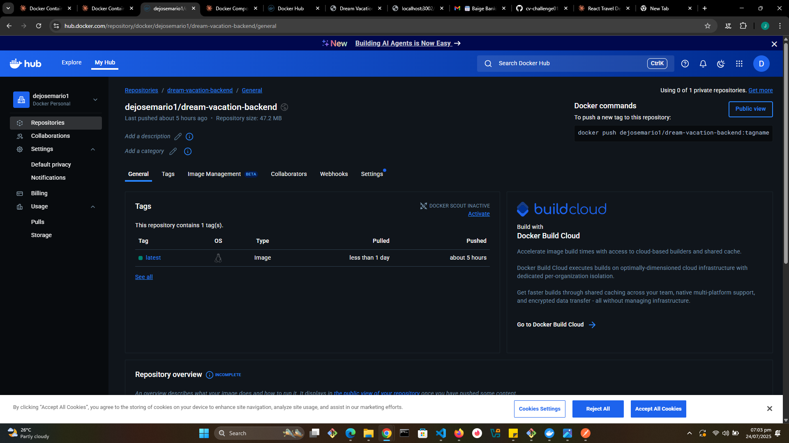
*Caption: Dream Vacation Backend repository on Docker Hub*

### Frontend Repository
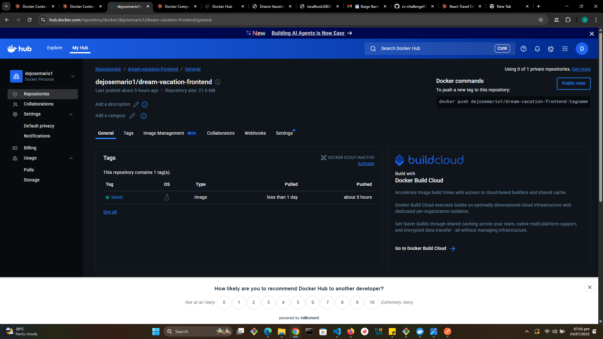
*Caption: Dream Vacation Frontend repository on Docker Hub*

### All Repositories Overview

*Caption: Overview of all my repositories under my Docker Hub.*

### Running Application
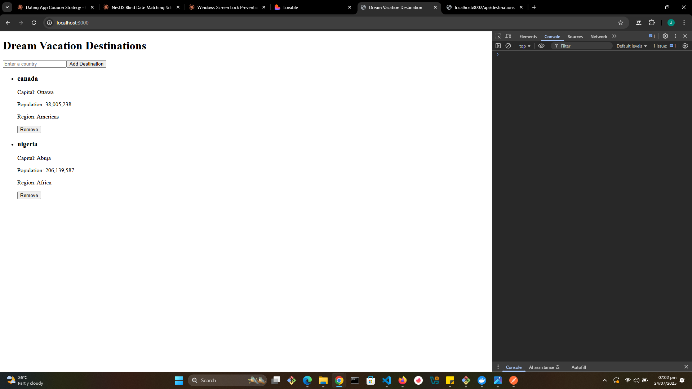
*Caption: Dream Vacation Destinations app running locally, showing Canada and Nigeria details.*

---

## 🔄 CI/CD with GitHub Actions
This project implements automated CI/CD pipelines using GitHub Actions to build and push Docker images to Docker Hub.

### Workflow Configuration

The CI/CD pipeline is configured on the `github-actions` branch with separate workflows for frontend and backend:

#### Frontend Workflow (`.github/workflows/frontend.yaml`)
- **Triggers**: Push to `github-actions` branch when files in `frontend/` directory change
- **Actions**:
  - Builds Docker image from `frontend/Dockerfile`
  - Pushes to Docker Hub as `dejosemario1/dream-vacation-frontend`
  - Generates automatic tags based on branch and commit SHA
  - Uses Docker layer caching for faster builds


#### Backend Workflow (`.github/workflows/backend.yaml`)
- **Triggers**: Push to `github-actions` branch when files in `backend/` directory change
- **Actions**:
  - Builds Docker image from `backend/Dockerfile`
  - Pushes to Docker Hub as `dejosemario1/dream-vacation-backend`
  - Automated tagging and metadata extraction


### GitHub Actions Features
- ✅ **Path-based triggering**: Workflows only run when relevant files change
- ✅ **Docker Hub integration**: Automatic image building and pushing
- ✅ **Secure secrets management**: Docker credentials stored as GitHub secrets
- ✅ **Caching**: Docker layer caching for improved build performance
- ✅ **Multi-platform support**: Ready for arm64/amd64 builds
- ✅ **Manual triggering**: `workflow_dispatch` for on-demand runs

### Setting up CI/CD
1. **Fork this repository**
2. **Add Docker Hub secrets** in repository settings:
   - `DOCKER_USERNAME`: Your Docker Hub username
   - `DOCKER_TOKEN`: Your Docker Hub access token
3. **Push changes** to the `github-actions` branch
4. **Watch workflows** run automatically in the Actions tab

---

## 📤 Pushed Docker Images

* **Frontend**: `docker.io/dejosemario1/dream-vacation-frontend`
* **Backend**: `docker.io/dejosemario1/dream-vacation-backend`


---

## ✅ Features

* Multi-stage Docker builds for optimized frontend
* Distinct services for clear separation of responsibilities
* Environment setup using .env file at the root
* Suitable for local and production Docker deployments
* Persistent PostgreSQL data with Docker volumes
* **Automated CI/CD pipelines with GitHub Actions**
* **Docker Hub integration for seamless deployments**

## 📤 My Docker Hub Pushed Images In My Repositories

### Backend Repository
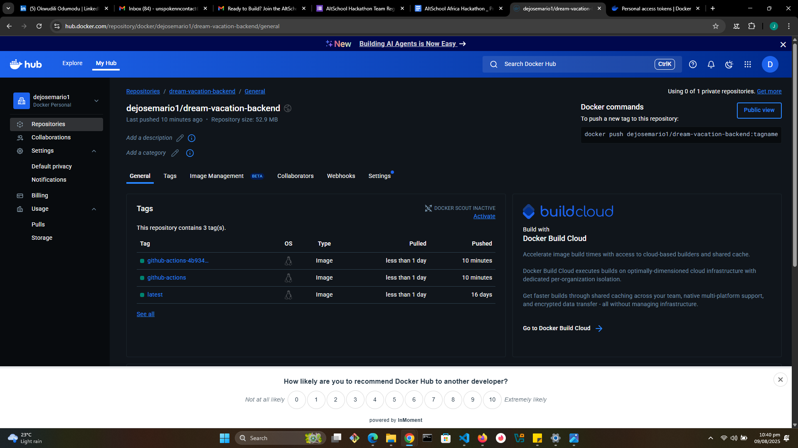
*Caption: Dream Vacation Backend repository on Docker Hub after the new build*

### Frontend Repository
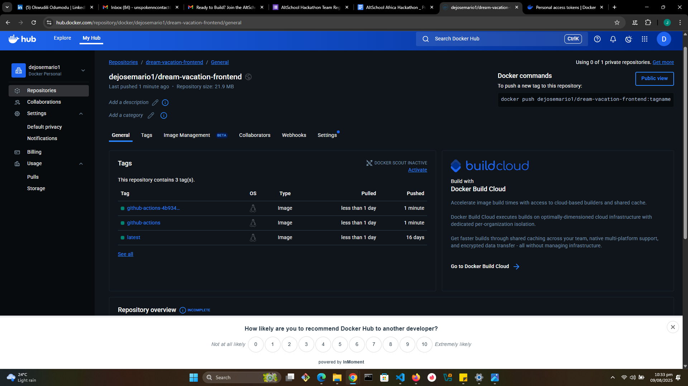
*Caption: Dream Vacation Frontend repository on Docker Hub after the new build*

### Github Actions After Build is Complete
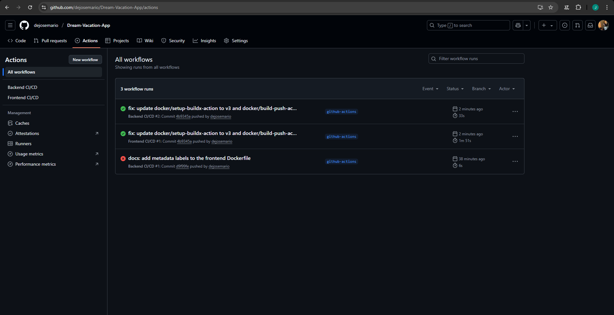
*Caption: Overview of my github actions after the build.*


### Branch Strategy
- **`main`**: Production-ready code
- **`github-actions`**: CI/CD development and testing

## 🔧 Technical Stack

- **Frontend**: React.js, Docker
- **Backend**: Node.js, Express.js, Docker
- **Database**: PostgreSQL
- **CI/CD**: GitHub Actions
- **Container Registry**: Docker Hub
- **Infrastructure**: Docker Compose.


## 🔄 CI/CD Dream Vacation App Deployment on AWS EC2 with Custom VPC, GitHub Actions, and Docker Hub

## 📋 Project Overview

This project demonstrates the deployment of the **Dream Vacation App** on AWS EC2 using a custom VPC network configuration and automated CI/CD pipeline with GitHub Actions and Docker Hub integration.

**🔗 Repository**: [Dream Vacation App](https://github.com/obusorezekiel/Dream-Vacation-App)

---

## 🌐 Part 1 – Networking Setup

### 1.1 Create Custom VPC

**Step 1**: Navigate to AWS Console → VPC → Create VPC

**⚙️ Configuration**:
- **Name**: `dream-vpc`
- **IPv4 CIDR**: `10.0.0.0/16`
- **IPv6 CIDR**: No IPv6 CIDR Block
- **Tenancy**: Default

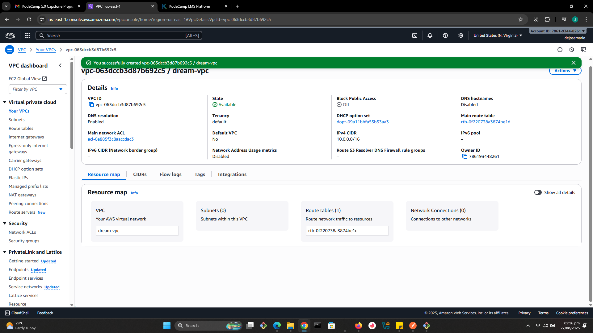
*Screenshot: Custom VPC (dream-vpc) created with CIDR block 10.0.0.0/16*


### 1.2 Create Subnet

**Step 2**: VPC Dashboard → Subnets → Create Subnet

**⚙️ Configuration**:
- **VPC**: `dream-vpc`
- **Name**: `dream-subnet`
- **Availability Zone**: `us-east-1a`
- **IPv4 CIDR**: `10.0.1.0/24`

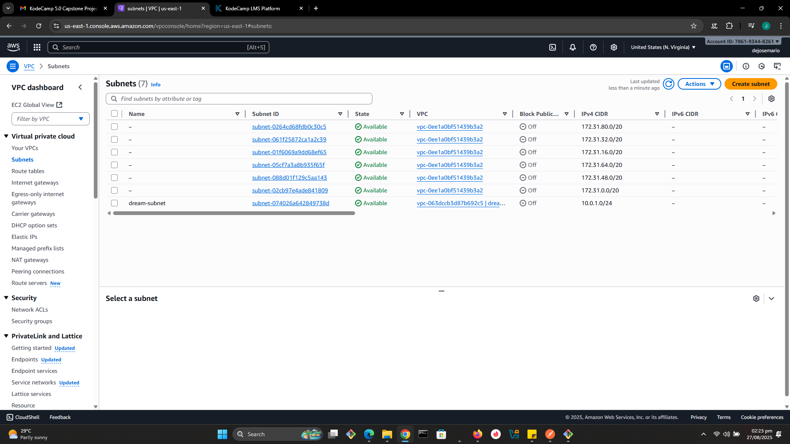
*Screenshot: Subnet (dream-subnet) created with CIDR block 10.0.1.0/24*

### 1.3 Create Internet Gateway

**Step 3**: VPC Dashboard → Internet Gateways → Create Internet Gateway

**⚙️ Configuration**:
- **Name**: `dream-igw`
- **Action**: Attach to VPC → Select `dream-vpc`

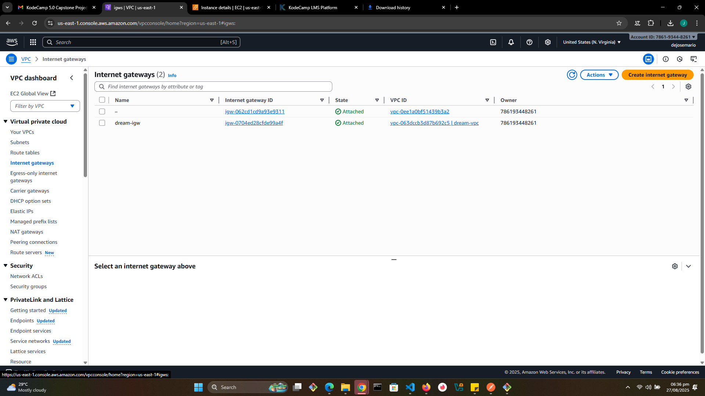
*Screenshot: Internet Gateway (dream-igw) attached to dream-vpc*

### 1.4 Create and Configure Route Table

**Step 4**: VPC Dashboard → Route Tables → Create Route Table

**⚙️ Configuration**:
- **Name**: `dream-rt`
- **VPC**: `dream-vpc`

**🛣️ Route Configuration**:
- **Routes Tab** → Edit routes → Add route
- **Destination**: `0.0.0.0/0`
- **Target**: Internet Gateway → `dream-igw`

**🔗 Subnet Association**:
- **Subnet Associations Tab** → Edit subnet associations
- **Select**: `dream-subnet`

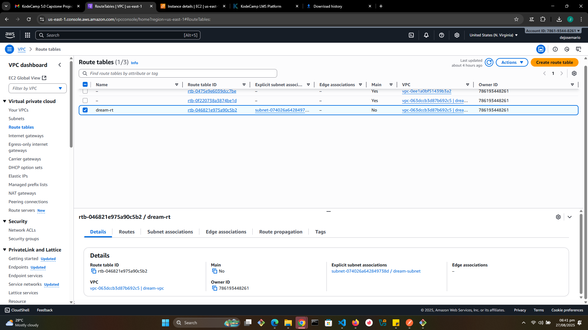
*Screenshot: Route table (dream-rt) configured with internet route and subnet association*

## 🖥️ Part 2 – EC2 Instance Setup

### 2.1 Create Security Group

**Step 1**: EC2 Dashboard → Security Groups → Create Security Group

**⚙️ Configuration**:
- **Name**: `dream-app-sg`
- **Description**: `Security group for Dream Vacation App`
- **VPC**: `dream-vpc`

**🔒 Inbound Rules**:
| Type | Port | Source | Description |
|------|------|--------|-------------|
| SSH | 22 | My IP | SSH access |
| HTTP | 80 | 0.0.0.0/0 | Web traffic |
| Custom TCP | 3000 | 0.0.0.0/0 | Frontend |
| Custom TCP | 3001 | 0.0.0.0/0 | Backend API |

### 2.2 Launch EC2 Instance

**Step 2**: EC2 Dashboard → Launch Instance

**⚙️ Configuration**:
- **Name**: `dream-vacation-server`
- **AMI**: `Ubuntu Server 22.04 LTS`
- **Instance Type**: `t2.micro`
- **Key Pair**: Create new or select existing
- **Network Settings**:
  - **VPC**: `dream-vpc`
  - **Subnet**: `dream-subnet`
  - **Auto-assign Public IP**: Enable
  - **Security Group**: `dream-app-sg`

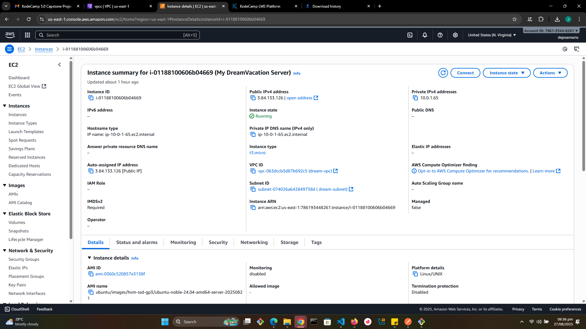
*Screenshot: EC2 instance (dream-vacation-server) running in custom VPC*

---

## 🚀 Part 3 – CI/CD Deployment

The **GitHub Actions CI/CD pipeline** automates the entire deployment process from code commit to production deployment on AWS EC2. This smart pipeline only builds and deploys changed components, making it efficient and fast.

### Pipeline Architecture

**📋 Change Detection Stage**:
- **Smart Path Filtering**: Detects which parts of the application changed
- **Backend Changes**: Monitors `backend/**` and `docker-compose.yml`
- **Frontend Changes**: Monitors `frontend/**` and `docker-compose.yml`
- **Conditional Building**: Only builds components that actually changed

**🔨 Build Stage** (Parallel Execution):
1. **Backend Build Job** (if backend changed):
   - Builds Docker image from `backend/Dockerfile`
   - Pushes to Docker Hub as `your-username/dream-vacation-backend:SHA`
   - Uses commit SHA for unique image tagging

2. **Frontend Build Job** (if frontend changed):
   - Builds Docker image from `frontend/Dockerfile`
   - Pushes to Docker Hub as `your-username/dream-vacation-frontend:SHA`
   - Uses commit SHA for unique image tagging

**🚀 Deploy Stage**:
3. **EC2 Deployment Job**:
   - **Repository Sync**: Clones/pulls latest code to get `docker-compose.yml`
   - **Dynamic Environment**: Creates `.env` file with:
     - Newly built image tags (SHA-based) for changed components
     - Latest tags for unchanged components
     - Database configuration with production settings
     - API URL with EC2 public IP auto-detection
   - **Image Management**: Only pulls newly built images
   - **Container Orchestration**: Stops old containers and starts new ones
   - **Health Verification**: Waits for containers to be ready
   - **Logging**: Shows container status and logs for debugging

**🏥 Health Check Stage**:
- **Frontend Health**: Checks if port 3000 is responding
- **Backend Health**: Checks if port 3001 is responding  
- **Container Status**: Shows running containers
- **Debug Logs**: Displays recent logs from all services

### Pipeline Triggers
- **Branch**: Triggered on push to `main` or `deployment` branch
- **Manual**: Can be triggered via GitHub Actions interface
- **Conditional**: Only runs if relevant files changed

### Environment Configuration
```bash
# Database Settings
DB_NAME=dreamvacation
DB_USER=postgres
DB_PASSWORD=yourpassword123
DATABASE_URL=postgresql://postgres:yourpassword123@db:5432/dreamvacation

# Application Settings
NODE_ENV=production
COUNTRIES_API_BASE_URL=https://restcountries.com/v3.1
REACT_APP_API_URL=http://EC2-PUBLIC-IP:3001/api

# Dynamic Image Tags
BACKEND_IMAGE=your-username/dream-vacation-backend:COMMIT-SHA
FRONTEND_IMAGE=your-username/dream-vacation-frontend:COMMIT-SHA

```

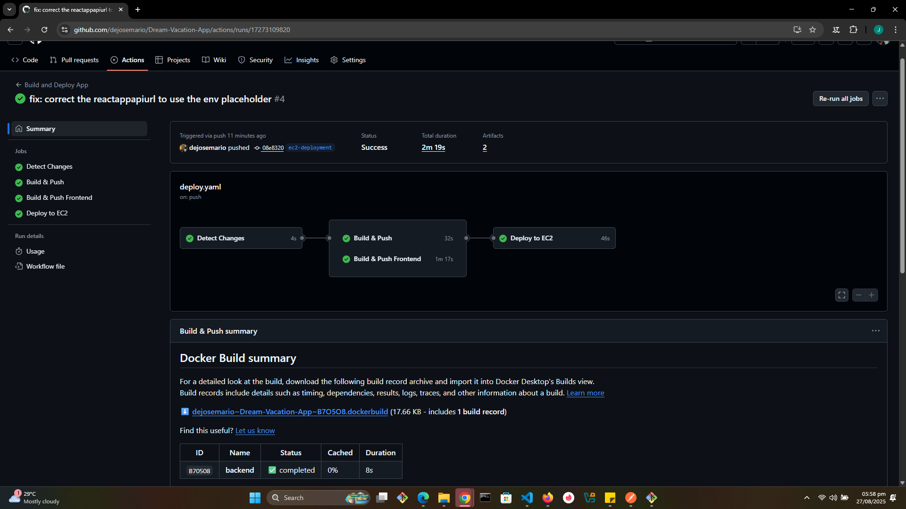
*Screenshot: GitHub Actions workflow showing successful CI/CD pipeline execution*

## 🌐 Application Running in Browser

The **Dream Vacation App** is successfully deployed and accessible via the EC2 instance's public IP address. The application displays a clean, functional interface for managing dream vacation destinations.

### Access Information

**🔗 Application URLs**:
- **Frontend**: `http://3.84.133.126:3000`
- **Backend API**: `http://3.84.133.126:3001`
- **Health Check**: `http://3.84.133.126:3001/api/health`

**🔧 Behind the Scenes**:
- **Frontend**: React.js serving the interface
- **Backend**: Node.js API handling requests on port 3001
- **Database**: PostgreSQL storing user's country selections
- **External API**: REST Countries API providing country data

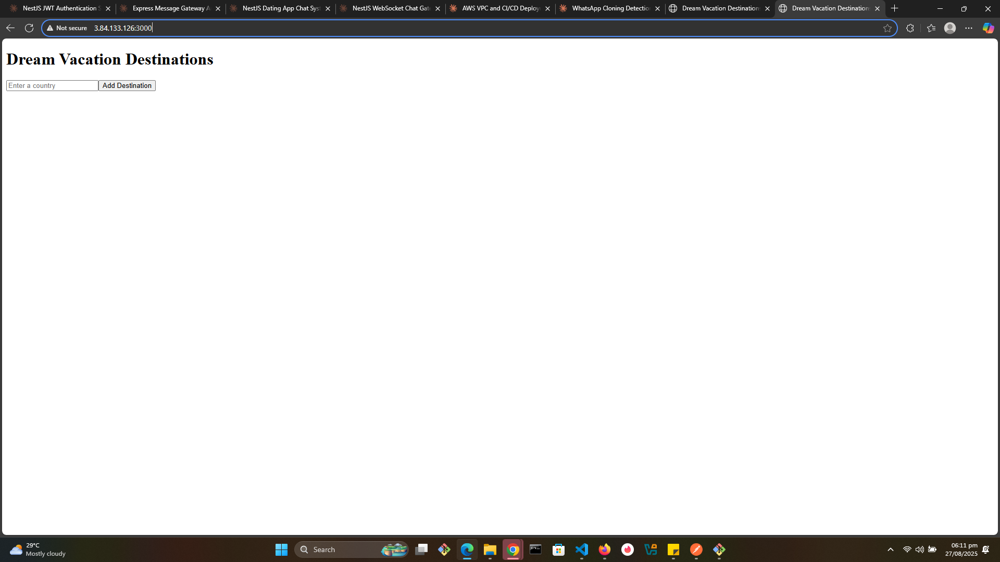
*Screenshot: Dream Vacation App successfully running at http://3.84.133.126:3000 showing the main interface with country input functionality*

The application is fully operational and ready for users to start adding their dream vacation destinations!