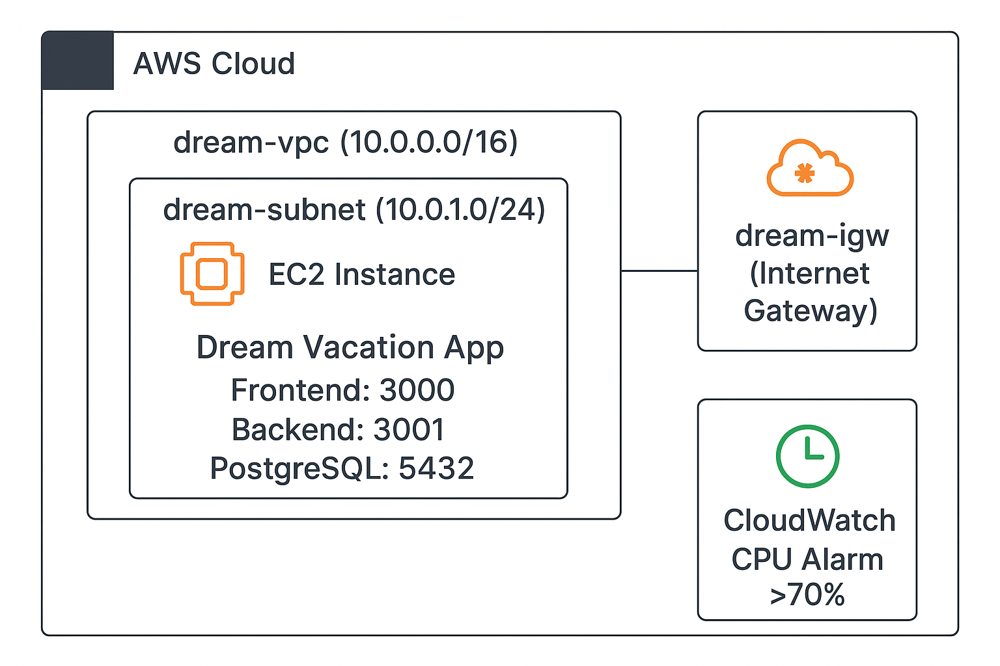
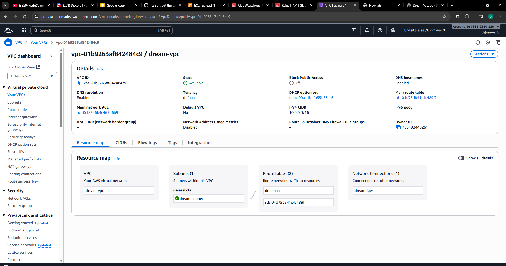
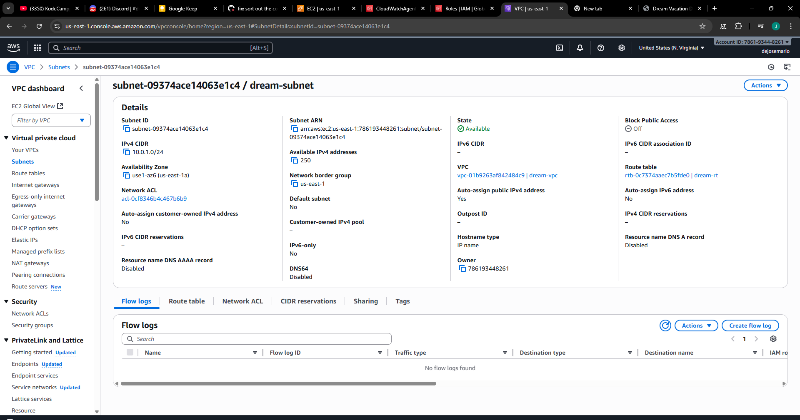
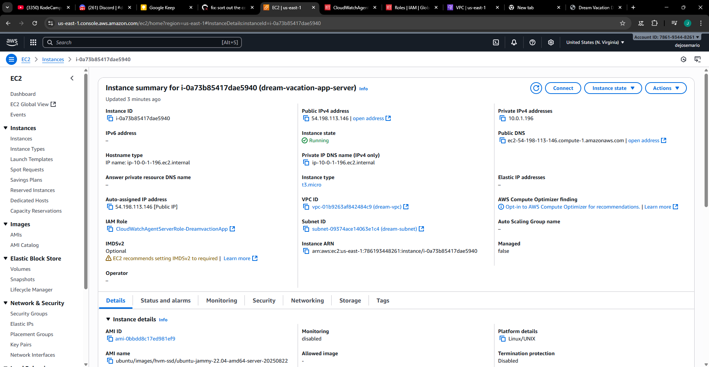
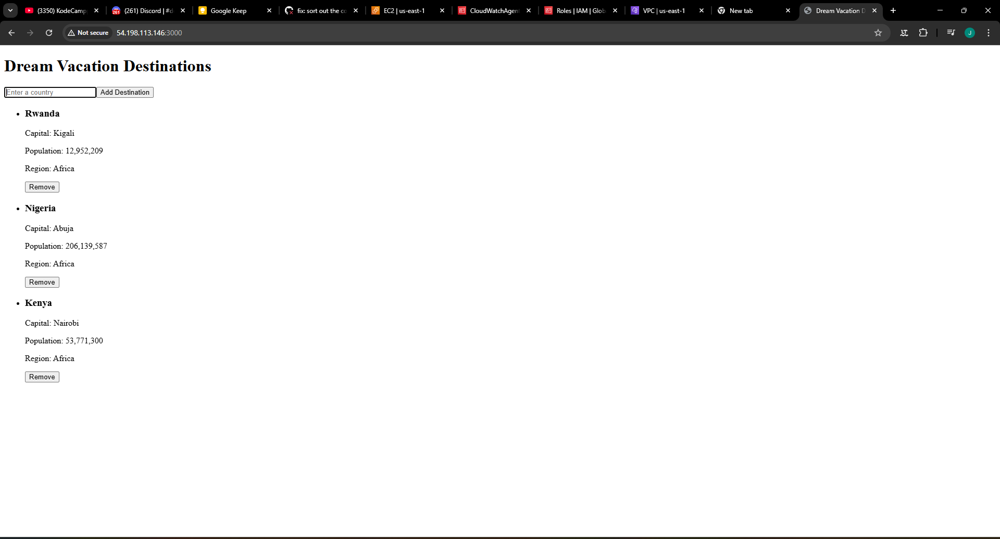
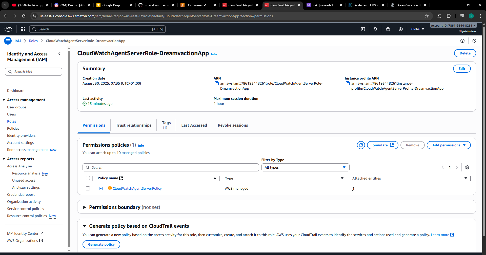
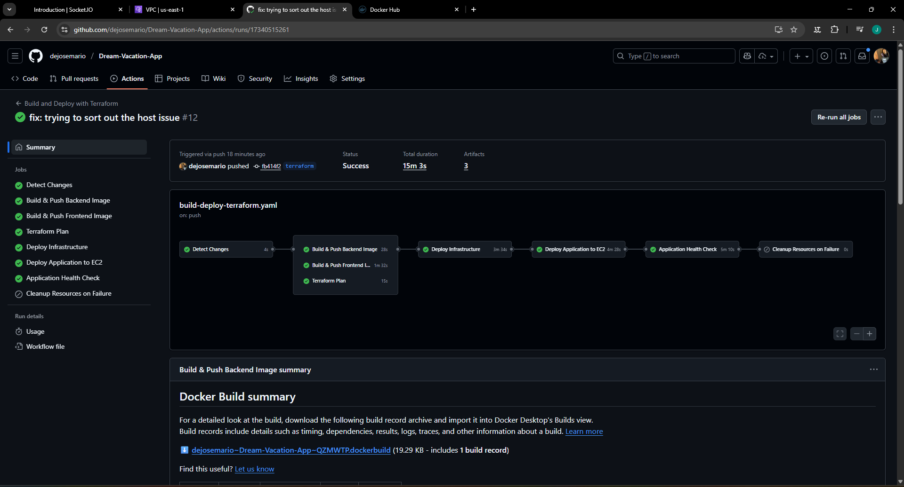

# Dream Vacation App - AWS Infrastructure with Terraform
This project demonstrates Infrastructure as Code (IaC) using Terraform to provision AWS resources and deploy a containerized Dream Vacation application with automated CI/CD pipeline integration.

## Project Overview

The infrastructure consists of:
- Custom VPC with public subnet
- EC2 instance running Ubuntu with Docker
- Security Groups for SSH and HTTP access
- CloudWatch monitoring with CPU utilization alarms
- IAM roles for CloudWatch Agent
- Automated CI/CD pipeline with Terraform deployment

## Architecture Diagram

*Diagram giving a pictorial representation of the terraform architecture

## Part 1: Networking Setup (Terraform)

### VPC Configuration
```hcl
resource "aws_vpc" "dream_vpc" {
  cidr_block           = "10.0.0.0/16"
  enable_dns_hostnames = true
  enable_dns_support   = true

  tags = {
    Name = "dream-vpc"
  }
}
```

### Subnet Configuration
```hcl
resource "aws_subnet" "dream_subnet" {
  vpc_id                  = aws_vpc.dream_vpc.id
  cidr_block              = "10.0.1.0/24"
  availability_zone       = "us-east-1a"
  map_public_ip_on_launch = true

  tags = {
    Name = "dream-subnet"
  }
}
```

### Internet Gateway
```hcl
resource "aws_internet_gateway" "dream_igw" {
  vpc_id = aws_vpc.dream_vpc.id

  tags = {
    Name = "dream-igw"
  }
}
```

### Route Table and Association
```hcl 
resource "aws_route_table" "dream_rt" {
  vpc_id = aws_vpc.dream_vpc.id

  route {
    cidr_block = "0.0.0.0/0"
    gateway_id = aws_internet_gateway.dream_igw.id
  }

  tags = {
    Name = "dream-rt"
  }
}

resource "aws_route_table_association" "dream_rta" {
  subnet_id      = aws_subnet.dream_subnet.id
  route_table_id = aws_route_table.dream_rt.id
}
```

## Part 2: EC2 Instance Setup (Terraform)

### Security Group Configuration
```hcl
resource "aws_security_group" "dream_sg" {
  name        = "dream-security-group"
  description = "Security group for Dream Vacation App"
  vpc_id      = aws_vpc.dream_vpc.id

  # SSH access
  ingress {
    from_port   = 22
    to_port     = 22
    protocol    = "tcp"
    cidr_blocks = ["0.0.0.0/0"]
  }

  # HTTP access
  ingress {
    from_port   = 80
    to_port     = 80
    protocol    = "tcp"
    cidr_blocks = ["0.0.0.0/0"]
  }

  
  # HTTPS access
  ingress {
    from_port   = 443
    to_port     = 443
    protocol    = "tcp"
    cidr_blocks = ["0.0.0.0/0"]
  }

  # Frontend (port 3000)
  ingress {
    from_port   = 3000
    to_port     = 3000
    protocol    = "tcp"
    cidr_blocks = ["0.0.0.0/0"]
  }

  # Backend (port 3001)
    ingress {
      from_port   = 3001
      to_port     = 3001
      protocol    = "tcp"
      cidr_blocks = ["0.0.0.0/0"]
  }

  # All outbound traffic
  egress {
    from_port   = 0
    to_port     = 0
    protocol    = "-1"
    cidr_blocks = ["0.0.0.0/0"]
  }

  tags = {
    Name = "dream-security-group"
  }
}
```

### EC2 Instance with Latest Ubuntu LTS

```hcl
data "aws_ami" "ubuntu" {
  most_recent = true
  owners      = ["099720109477"] # Canonical

  filter {
    name   = "name"
    values = ["ubuntu/images/hvm-ssd/ubuntu-jammy-22.04-amd64-server-*"]
  }

  filter {
    name   = "virtualization-type"
    values = ["hvm"]
  }
}

resource "aws_instance" "dream_app_server" {
  ami                    = data.aws_ami.ubuntu.id
  instance_type          = "t2.micro"
  key_name               = var.key_name
  subnet_id              = aws_subnet.dream_subnet.id
  vpc_security_group_ids = [aws_security_group.dream_sg.id]
  iam_instance_profile   = aws_iam_instance_profile.cloudwatch_agent_profile.name

  user_data = file("user_data.sh")

  tags = {
    Name = "dream-vacation-app-server"
  }
}
```

### User Data Script (user_data.sh)
```bash
#!/bin/bash

# Update system packages
sudo apt-get update -y

# Install Docker
sudo apt-get install -y apt-transport-https ca-certificates curl software-properties-common
curl -fsSL https://download.docker.com/linux/ubuntu/gpg | sudo gpg --dearmor -o /usr/share/keyrings/docker-archive-keyring.gpg
echo "deb [arch=$(dpkg --print-architecture) signed-by=/usr/share/keyrings/docker-archive-keyring.gpg] https://download.docker.com/linux/ubuntu $(lsb_release -cs) stable" | sudo tee /etc/apt/sources.list.d/docker.list > /dev/null
sudo apt-get update -y
sudo apt-get install -y docker-ce docker-ce-cli containerd.io

# Start and enable Docker
sudo systemctl start docker
sudo systemctl enable docker

# Add ubuntu user to docker group
sudo usermod -aG docker ubuntu

# Install Docker Compose
sudo curl -L "https://github.com/docker/compose/releases/latest/download/docker-compose-$(uname -s)-$(uname -m)" -o /usr/local/bin/docker-compose
sudo chmod +x /usr/local/bin/docker-compose

# Install CloudWatch Agent
wget https://s3.amazonaws.com/amazoncloudwatch-agent/ubuntu/amd64/latest/amazon-cloudwatch-agent.deb
sudo dpkg -i -E ./amazon-cloudwatch-agent.deb

# Configure CloudWatch Agent
sudo tee /opt/aws/amazon-cloudwatch-agent/etc/amazon-cloudwatch-agent.json > /dev/null <<EOF
{
    "agent": {
        "metrics_collection_interval": 60,
        "run_as_user": "cwagent"
    },
    "metrics": {
        "namespace": "CWAgent",
        "metrics_collected": {
            "cpu": {
                "measurement": [
                    "cpu_usage_idle",
                    "cpu_usage_iowait",
                    "cpu_usage_user",
                    "cpu_usage_system"
                ],
                "metrics_collection_interval": 60
            }
        }
    }
}
EOF

# Start CloudWatch Agent
sudo /opt/aws/amazon-cloudwatch-agent/bin/amazon-cloudwatch-agent-ctl \
    -a fetch-config \
    -m ec2 \
    -c file:/opt/aws/amazon-cloudwatch-agent/etc/amazon-cloudwatch-agent.json \
    -s

echo "User data script completed successfully!" > /home/ubuntu/user-data.log
```

## Part 3: CloudWatch Monitoring (Terraform)
### IAM Role for CloudWatch Agent
```hcl
resource "aws_iam_role" "cloudwatch_agent_role" {
  name = "CloudWatchAgentServerRole"

  assume_role_policy = jsonencode({
    Version = "2012-10-17"
    Statement = [
      {
        Action = "sts:AssumeRole"
        Effect = "Allow"
        Principal = {
          Service = "ec2.amazonaws.com"
        }
      }
    ]
  })

  tags = {
    Name = "CloudWatchAgentServerRole"
  }
}

resource "aws_iam_role_policy_attachment" "cloudwatch_agent_policy" {
  role       = aws_iam_role.cloudwatch_agent_role.name
  policy_arn = "arn:aws:iam::aws:policy/CloudWatchAgentServerPolicy"
}

resource "aws_iam_instance_profile" "cloudwatch_agent_profile" {
  name = "CloudWatchAgentServerProfile"
  role = aws_iam_role.cloudwatch_agent_role.name
}
```

### CloudWatch CPU Alarm
```hcl
resource "aws_cloudwatch_metric_alarm" "cpu_alarm" {
  alarm_name          = "dream-app-high-cpu"
  comparison_operator = "GreaterThanThreshold"
  evaluation_periods  = "2"
  metric_name         = "CPUUtilization"
  namespace           = "AWS/EC2"
  period              = "60"
  statistic           = "Average"
  threshold           = "70"
  alarm_description   = "This metric monitors ec2 cpu utilization"

  dimensions = {
    InstanceId = aws_instance.dream_app_server.id
  }

  tags = {
    Name = "dream-app-cpu-alarm"
  }
}
```

# Dream Vacation App Deployment Screenshot

### AWS Console - VPC and Subnet
  
VPC and subnet created via Terraform showing proper CIDR configuration.  

  
Subnet details within the custom VPC.

### AWS Console - EC2 Instance
  
EC2 instance running in custom VPC with proper security group configuration.

### Dream Vacation App Running
  
Dream Vacation App successfully running and accessible via EC2 public IP.

### CloudWatch CPU Metrics and Alarms
  
CloudWatch CPU alarm configured with 70% threshold and EC2 metrics being collected.

### CI/CD Pipeline Success
  
GitHub Actions workflow showing successful Terraform deployment and application deployment.

## Cleanup
To avoid AWS charges, destroy resources when not needed:

```bash
terraform destroy
```

## Technical Specifications

- **Infrastructure:** AWS VPC, EC2, CloudWatch, IAM
- **Configuration Management:** Terraform
- **Containerization:** Docker, Docker Compose
- **CI/CD:** GitHub Actions
- **Monitoring:** AWS CloudWatch, CloudWatch Agent
- **Operating System:** Ubuntu 22.04 LTS
- **Application Stack:** React, Node.js, PostgreSQL
